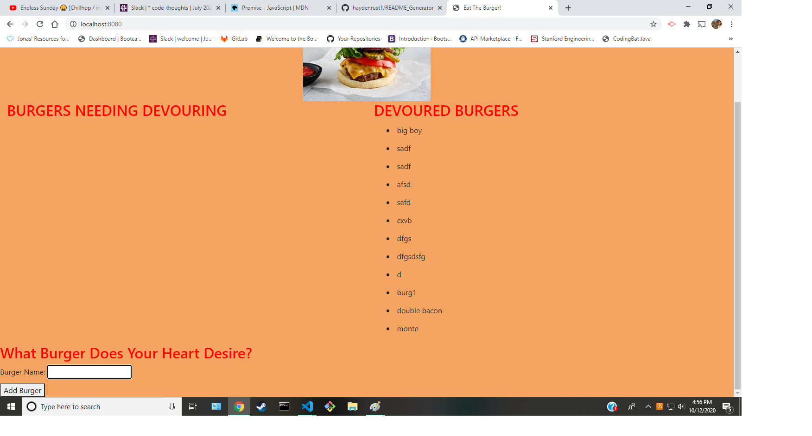

  # Eat The Burger

  

  ## Description
  * With the help of the MVC model, you can now store what burgers you want to eat..... AND EAT THEM! 

  ## Table of Contents
  * [Installation](#installation)
  * [Usage](#usage)
  * [License](#license)
  * [Questions](#questions)
  
  ## Usage
  * This application allows a user to eat what ever kind of burger their heart desires! (digitally of course so its free calories)
  

  ## License
  * This project is licensed under: MIT
  
  ## Questions
  Please contact me with any questions you may have using the links below!
  * [GitHub Profile](https://github.com/haydenrust1)
  * <haydenrust1@gmail.com>
  